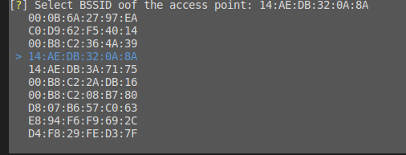

# Deauth attack - Course Asignment

#### Summary and notes ####
* Tested on 2.4 GHz,not sure about 5Ghz
* The code tested with TL-WN722N that taken from labaratory.
* Deauthentication tested on private huawei phone that connected to bezeq Vtech router,didnt tested on neighbours :-)
* On some day working code just stopped finding connected stations of access point,wasted on that whole day and tomorrow it magically started to work again, the frustrating part is that there is no clue why it didnt work.
* Some of the code is taken from various places on the web, modified to be as it now.
* Accidentaly run kali as root(bad practice), so i hope everything will work properly on least previledged account as well.    In case you dont run on root it adds complexity ,added specific instructions for that case as well,ill mark them as **notRoot**
* Would really like to hear you feeback about the solution,code structuring and design descisions made.

#### Requirements ####
```python 3.9``` Comes with *kali* latest distribution,that installed as dual boot,so  the code is not tested on lower python versions


### Usage ###


#### Step 1 - Clone the repo

```cd Assignment1-Deauth```

#### Step 2 - Setup virtual environment
We dont want to pollute our environement

Install venv -   ```apt-get install python3-venv```    
**notRoot** ```sudo apt-get install python3-venv```

Create venv  ```python3 -m venv wifi-deauth```

Activate environemnt ```source wifi-deauth/bin/activate```


#### Step 3 - Install requirements
run ```pip install -r requirements.txt```


#### Step 4 - Main program

You just need to select the desired inputs



run ```python3 main.py --help``` to see if default parameters are good for you.   
If so, run ```python3 main.py```  
**notRoot** - Because sudo activates own environment we need to tell explcitly that we want to run on environment we installed
run ``` sudo {pathToTheEnvironment}/bin/python3 main.py```    

for example ```sudo ~/repos/cyber_wifi_defence-master/Assignment1-Deauth/wifi-deauth/bin/python3 main.py```

### Troubleshooting 

**Problem:** 
```No such file or directory: b'liblibc.a'``` this problem occures on python 3.9+   
**Solution:** 
```cd /usr/lib/x86_64-linux-gnu/```
```ln -s -f libc.a liblibc.a```
